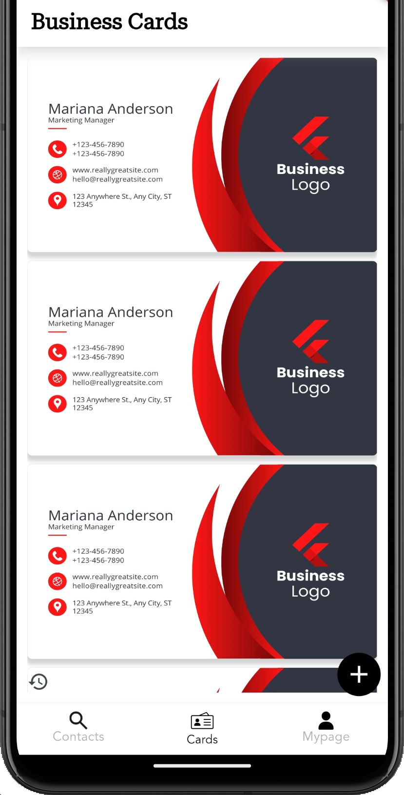
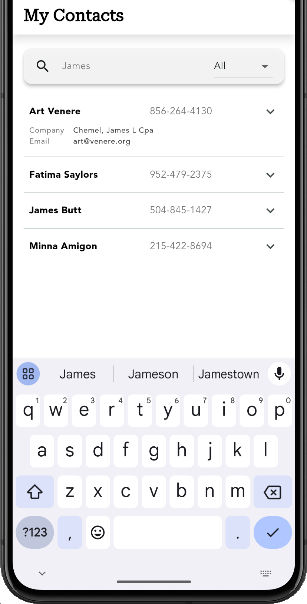
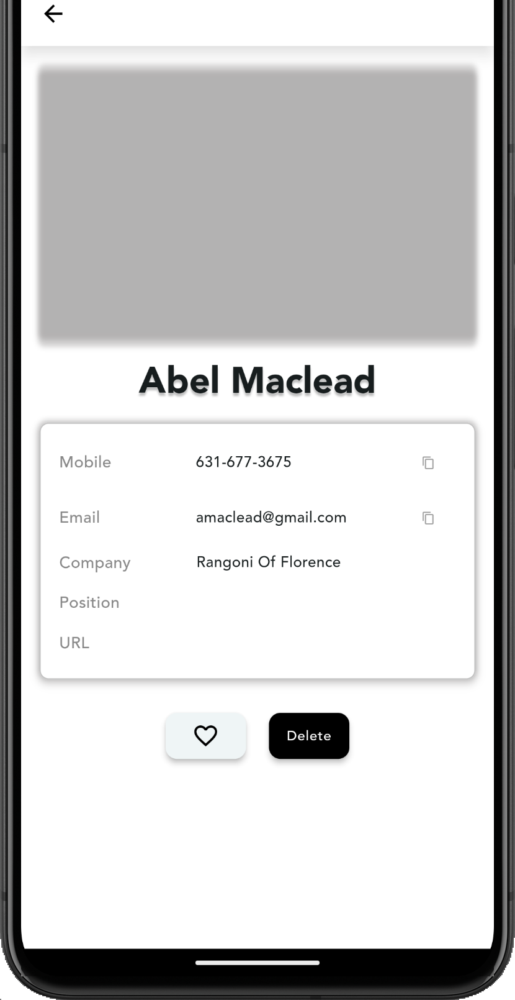
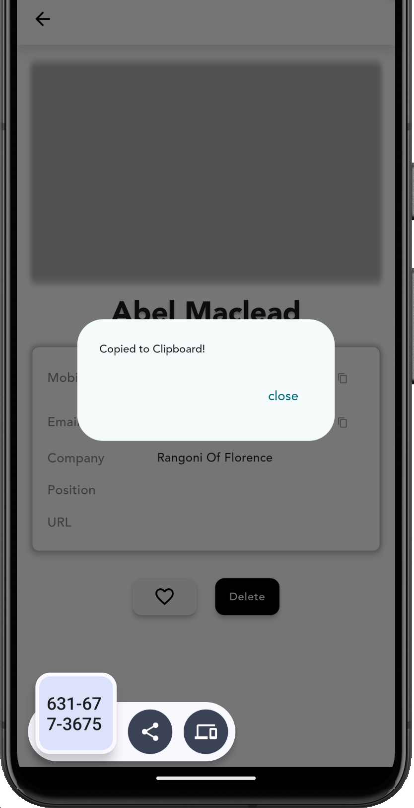

# Custard

**카스타드(Custard)**는 사람들의 연락처를 명함과 연동하여 디지털 관리가 가능한 명함 및 연락처 관리 앱입니다.

명함의 **이미지 자동 분석**으로 명함의 정보를 연락처와 연동하여 관리하고 저장할 수 있으며, **이름**, **전화번호**, **이메일**, **회사**, **직무**, **외부링크** 관리가 가능합니다.

3개의 탭은 저장된 명함 **연락처 탭, 명함 이미지 탭, 나의 명함 정보 수정 탭**으로 구성되어 있습니다.

## Development
### Android
  - Hybrid Application (Flutter)
  - Local Database (SQLite)
  - AI Cloud Service (Gemini API)

## Team
- 박상우
  - cloud service api management
  - local data storage management

- 주서현
  - UI/UX design
  - application component implementation

## Demo
[Drive link(.apk)](https://drive.google.com/file/d/1seQudaqi4Bx23YgIh10N4y5RlqIowR64/view?usp=share_link)

